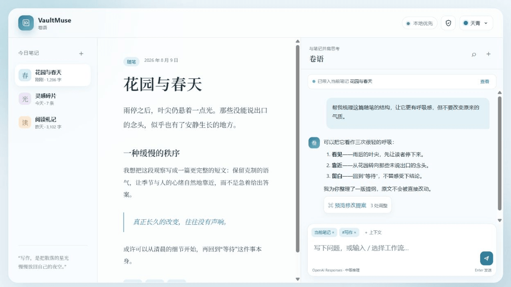
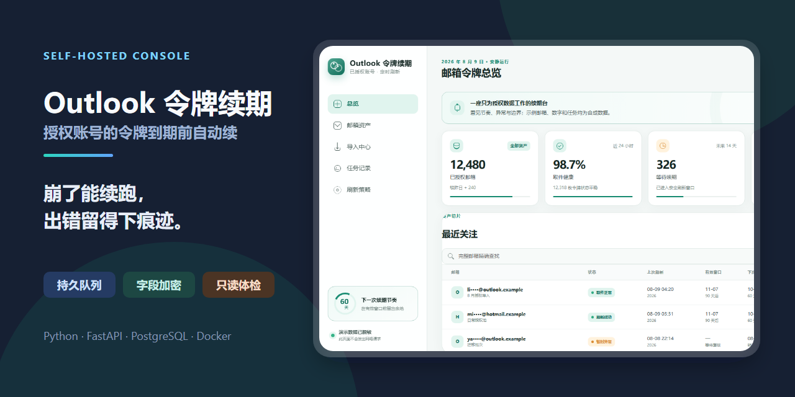

  

  
  
  
  

  <strong>我喜欢把复杂的东西慢慢理清，再做成安静、可靠、有人情味的工具。</strong> 
  <em>I like untangling complicated things and turning them into calm, dependable tools with a human touch.</em>

---

## 作品 / Work

### 01 · [CPA-X — CLIProxyAPI 管理面板 / CLIProxyAPI Admin Dashboard](https://github.com/ferretgeek/CPA-X)

**CLIProxyAPI 监控与管理面板。** 集中查看运行状态、请求用量、费用、日志和配置，并提供带校验与回滚的安全更新。

*A CLIProxyAPI admin dashboard for health, usage, cost, logs, configuration checks, and verified updates with rollback.*

**看点 / Focus** — 运行全景 / overview · 安全更新与回滚 / safe updates and rollback · Windows / Linux / Docker · **技术 / Stack** — `Python` · `Flask` · `Waitress`

[项目 / Repository](https://github.com/ferretgeek/CPA-X) · [下载 / Releases](https://github.com/ferretgeek/CPA-X/releases/latest) · [中文文档 / Docs](https://github.com/ferretgeek/CPA-X/blob/main/README_CN.md)

---

### 02 · [Codex Orbit — Codex 额度悬浮窗 / Codex Quota Widget](https://github.com/ferretgeek/CodexOrbit)

**Windows Codex 额度悬浮窗。** 实时显示 ChatGPT 套餐中的 Codex 主额度、重置倒计时与数据状态，无需打开完整控制台。

*A Windows desktop widget for live ChatGPT-plan Codex quota, reset countdowns, and source status without opening a full dashboard.*

**看点 / Focus** — 一眼可读 / glanceable · 多主题与迷你视图 / themes and compact views · 本地、无遥测 / local, no telemetry · **技术 / Stack** — `C#` · `WPF` · `.NET Framework 4.8`

[项目 / Repository](https://github.com/ferretgeek/CodexOrbit) · [下载 / Releases](https://github.com/ferretgeek/CodexOrbit/releases/latest) · [架构 / Architecture](https://github.com/ferretgeek/CodexOrbit/blob/main/docs/ARCHITECTURE.md)

---

### 03 · [Codex Quota Overview — 多账户额度总览 / Multi-account Quota Dashboard](https://github.com/ferretgeek/codex-quota-overview)

**多账户 Codex 额度总览。** 批量导入本地认证 JSON、查询剩余额度，并用分页、汇总和 CSV 管理大量结果。

*A local multi-account Codex quota dashboard with bulk JSON import, live quota checks, paging, summaries, and CSV export.*

**看点 / Focus** — 批量导入 / bulk import · 大规模分页 / large result sets · 汇总与 CSV / summaries and CSV · **技术 / Stack** — `Go` · `React` · `TypeScript` · `Vite`

[项目 / Repository](https://github.com/ferretgeek/codex-quota-overview) · [下载 / Releases](https://github.com/ferretgeek/codex-quota-overview/releases/latest) · [使用说明 / Guide](https://github.com/ferretgeek/codex-quota-overview/blob/main/README.md)

---

### 04 · [LanPlay — 局域网 SMB 媒体播放器 / LAN SMB Media Player](https://github.com/ferretgeek/LanPlay)

**Android 局域网 SMB 媒体播放器。** 浏览 SMB 2/3 共享，播放视频，并管理字幕、续播、书签和本地观看记录。

*An Android media player for browsing SMB 2/3 shares, playing videos, and managing subtitles, resume state, bookmarks, and local history.*

**看点 / Focus** — SMB 浏览 / SMB browsing · 双播放内核 / dual playback engines · 字幕、续播与本地历史 / subtitles, resume, local history · **技术 / Stack** — `Kotlin` · `Compose` · `Media3` · `libVLC`

[项目 / Repository](https://github.com/ferretgeek/LanPlay) · [使用说明 / Guide](https://github.com/ferretgeek/LanPlay/blob/main/README.md) · [讨论 / Discussions](https://github.com/ferretgeek/LanPlay/discussions)

---

### 05 · [Vibe Prompt Recorder — AI 编程提示词记录 / AI Coding Prompt Recorder](https://github.com/ferretgeek/VibePromptRecorder)

**Windows AI 编程提示词记录工作台。** 离线整理项目、草稿、对话轮次和 Markdown 上下文，并提供搜索、备份与恢复。

*An offline Windows workspace for organizing AI coding projects, prompt drafts, conversation turns, Markdown context, search, backup, and recovery.*

**看点 / Focus** — 轮次时间线 / iteration timeline · Markdown 双模式 / two editing modes · 搜索、备份与恢复 / search, backup, recovery · **技术 / Stack** — `Tauri 2` · `Rust` · `React` · `SQLite`

[项目 / Repository](https://github.com/ferretgeek/VibePromptRecorder) · [使用说明 / Guide](https://github.com/ferretgeek/VibePromptRecorder/blob/main/README.md) · [讨论 / Discussions](https://github.com/ferretgeek/VibePromptRecorder/discussions)

---

### 06 · [Palworld Ops — 幻兽帕鲁服务器管理台 / Palworld Server Dashboard](https://github.com/ferretgeek/PalworldOps)

**幻兽帕鲁 Linux 服务端管理台。** 查看状态与性能，执行启停、备份、更新和世界设置，危险操作带确认与回滚边界。

*A Linux Palworld server dashboard for status, performance, start/stop controls, backups, updates, and guarded world settings.*

**看点 / Focus** — 安全运维 / guarded operations · 可验证备份 / verified backups · systemd 自动化 / automation · **技术 / Stack** — `Python` · `JavaScript` · `SQLite` · `systemd`

[项目 / Repository](https://github.com/ferretgeek/PalworldOps) · [使用说明 / Guide](https://github.com/ferretgeek/PalworldOps/blob/main/README.md) · [讨论 / Discussions](https://github.com/ferretgeek/PalworldOps/discussions)

---

### 07 · [Palworld Breeding Atlas — 幻兽帕鲁配种规划与图鉴 / Palworld Breeding Planner & Atlas](https://github.com/ferretgeek/PalworldBreedingAtlas)

**幻兽帕鲁配种规划与图鉴。** 查询 287 条图鉴和数万条配种关系，规划繁育路线，并以只读方式分析本地存档。

*A Palworld breeding planner and 287-entry atlas with route search, recipe lookup, and read-only local save analysis.*

**看点 / Focus** — 路线规划 / route planning · 反向发现 / reverse discovery · 本地、无遥测 / local, no telemetry · **技术 / Stack** — `Python` · `Tkinter` · `HTML` · `JavaScript`

[项目 / Repository](https://github.com/ferretgeek/PalworldBreedingAtlas) · [使用说明 / Guide](https://github.com/ferretgeek/PalworldBreedingAtlas/blob/main/README.md) · [数据说明 / Data](https://github.com/ferretgeek/PalworldBreedingAtlas/blob/main/docs/%E6%95%B0%E6%8D%AE%E6%9D%A5%E6%BA%90%E4%B8%8E%E6%9B%B4%E6%96%B0.md)

---

### 08 · [Ferret Mail — 自托管域名收件箱 / Self-hosted Domain Inbox](https://github.com/ferretgeek/FerretMail)

**自托管域名收件箱。** 接收多域名 SMTP 邮件，通过网页和 API 搜索来信、验证码、链接与附件。

*A self-hosted receive-only domain inbox for SMTP ingestion and web/API access to messages, codes, links, and attachments.*

**看点 / Focus** — 多域名收件 / multi-domain inbox · 验证码与附件 / codes and attachments · 备份与限流 / backup and rate limits · **技术 / Stack** — `Python stdlib` · `SMTP` · `SQLite`

[项目 / Repository](https://github.com/ferretgeek/FerretMail) · [部署 / Deploy](https://github.com/ferretgeek/FerretMail/blob/main/%E9%83%A8%E7%BD%B2%E6%95%99%E7%A8%8B.md) · [API / Docs](https://github.com/ferretgeek/FerretMail/blob/main/%E6%8A%80%E6%9C%AF%E6%96%87%E6%A1%A3.md)

---

### 09 · [航迹 / Trailmark — 代理节点可用性监控 / Proxy Availability Monitor](https://github.com/ferretgeek/Trailmark)

**代理节点可用性监控。** 通过真实 sing-box 代理链路检测 DNS、TCP、TLS、HTTP 与页面特征，定位节点或服务故障。

*A proxy availability monitor that tests DNS, TCP, TLS, HTTP, and page features through real sing-box routes to locate failures.*

**看点 / Focus** — 真实链路检测 / real-path probes · DNS、TCP、TLS 与页面特征 / layered diagnostics · 本地与服务器 / local and server · **技术 / Stack** — `Python` · `FastAPI` · `SQLite` · `sing-box`

[项目 / Repository](https://github.com/ferretgeek/Trailmark) · [English](https://github.com/ferretgeek/Trailmark/blob/main/README_EN.md) · [部署 / Deploy](https://github.com/ferretgeek/Trailmark/blob/main/docs/%E9%83%A8%E7%BD%B2%E4%B8%8E%E8%BF%90%E7%BB%B4.md)

---

### 10 · [信渡 / Mail Ferry — 邮箱取件链接 / Email Pickup Links](https://github.com/ferretgeek/MailFerry)

**自托管邮箱取件链接。** 把 IMAP 邮箱转换成独立、可撤销的网页取件 URL，并提供缓存、管理后台和部署工具。

*A self-hosted service that turns IMAP mailboxes into independent, revocable web pickup URLs with caching and an admin dashboard.*

**看点 / Focus** — 独立取件链接 / revocable pickup links · 缓存与降级读取 / resilient cache · 本地与服务器 / local and server · **技术 / Stack** — `Python stdlib` · `IMAP` · `SQLite` · `systemd`

[项目 / Repository](https://github.com/ferretgeek/MailFerry) · [English](https://github.com/ferretgeek/MailFerry/blob/main/README_EN.md) · [部署 / Deploy](https://github.com/ferretgeek/MailFerry/blob/main/docs/%E9%83%A8%E7%BD%B2%E8%AF%B4%E6%98%8E.md)

---

### 11 · [别名工坊 / Alias Atelier — 邮箱 +Tag 地址生成器 / Email +Tag Generator](https://github.com/ferretgeek/AliasAtelier)

**本地邮箱 +Tag 地址生成器。** 在浏览器内批量生成、遮罩预览并导出 Gmail、Microsoft 或自定义域名别名。

*A local-only browser tool for bulk-generating, masked-previewing, and exporting Gmail, Microsoft, or custom-domain +tag addresses.*

**看点 / Focus** — 纯本地处理 / local-only · 敏感字段安全遮挡 / masked metadata · 四套全局主题 / four global themes · **技术 / Stack** — `JavaScript` · `Python stdlib` · `Docker` · `Nginx`

[项目 / Repository](https://github.com/ferretgeek/AliasAtelier) · [English](https://github.com/ferretgeek/AliasAtelier/blob/main/README_EN.md) · [部署 / Deploy](https://github.com/ferretgeek/AliasAtelier/blob/main/docs/%E9%83%A8%E7%BD%B2%E8%AF%B4%E6%98%8E.md)

---

### 12 · [信港 / InboxHarbor — Outlook 批量收件台 / Outlook Batch Inbox](https://github.com/ferretgeek/InboxHarbor)

**Outlook 批量收件工作台。** 通过 OAuth2 只读查看多个 Microsoft 邮箱并提取验证码，凭据仅在内存使用。

*A privacy-first Outlook batch inbox for read-only OAuth2 access, verification-code extraction, and memory-only credentials.*

**看点 / Focus** — OAuth2 现代认证 / modern auth · 内存凭据 / memory-only credentials · 隐私遮罩 / privacy veil · 四套全局主题 / four themes · **技术 / Stack** — `Python stdlib` · `JavaScript` · `Docker`

[项目 / Repository](https://github.com/ferretgeek/InboxHarbor) · [English](https://github.com/ferretgeek/InboxHarbor/blob/main/README_EN.md) · [部署 / Deploy](https://github.com/ferretgeek/InboxHarbor/blob/main/docs/DEPLOYMENT.md)

---

### 13 · [凭证罗盘 / Credential Compass — CLIProxyAPI 凭证池体检 / CLIProxyAPI Credential Health](https://github.com/ferretgeek/CredentialCompass)

**CLIProxyAPI 凭证池体检面板。** 汇总账号健康、启用状态和额度轮廓，并提供可逆的停用与恢复操作。

*A CLIProxyAPI credential-pool dashboard for health, enablement, quota outlines, and reversible disable/restore controls.*

**看点 / Focus** — 默认只读 / read-only by default · 账号遮罩 / masked identities · 可逆状态控制 / reversible controls · 四套全局主题 / four themes · **技术 / Stack** — `Python stdlib` · `JavaScript` · `Docker`

[项目 / Repository](https://github.com/ferretgeek/CredentialCompass) · [English](https://github.com/ferretgeek/CredentialCompass/blob/main/README_EN.md) · [部署 / Deploy](https://github.com/ferretgeek/CredentialCompass/blob/main/docs/DEPLOYMENT.md)

---

### 14 · [隐邮花园 / Veil Garden — Hide My Email 地址管理 / Hide My Email Organizer](https://github.com/ferretgeek/VeilGarden)

**Hide My Email 地址整理工具。** 本地导入、搜索、标记、遮罩和导出已有隐私邮箱地址，不接管 Apple 账号。

*A local-first organizer for importing, searching, labeling, masking, and exporting existing Hide My Email addresses without controlling Apple accounts.*

**看点 / Focus** — 默认遮罩 / masked by default · 本地导入与备份 / local import and backup · 四套全局主题 / four themes · **技术 / Stack** — `Python stdlib` · `JavaScript` · `SQLite` · `Docker`

[项目 / Repository](https://github.com/ferretgeek/VeilGarden) · [English](https://github.com/ferretgeek/VeilGarden/blob/main/README_EN.md) · [部署 / Deploy](https://github.com/ferretgeek/VeilGarden/blob/main/docs/DEPLOYMENT.md)

---

### 15 · [信灯 / Mail Lantern — iCloud 验证码查找 / iCloud Code Finder](https://github.com/ferretgeek/MailLantern)

**iCloud 验证码查找工具。** 通过官方 IMAP 只读扫描最近邮件，提取验证码并遮罩发件人与收件人。

*A read-only iCloud IMAP tool that scans recent messages, extracts verification codes, and masks sender and recipient identities.*

**看点 / Focus** — 官方 iCloud IMAP / official iCloud IMAP · 密码仅驻留内存 / memory-only password · 本地与服务器 / local and server · 四套主题 / four themes · **技术 / Stack** — `Python stdlib` · `JavaScript` · `Docker`

[项目 / Repository](https://github.com/ferretgeek/MailLantern) · [English](https://github.com/ferretgeek/MailLantern/blob/main/README_EN.md) · [部署 / Deploy](https://github.com/ferretgeek/MailLantern/blob/main/docs/DEPLOYMENT.md)

---

### 16 · [卷语 / VaultMuse — Obsidian AI 对话与写作 / Obsidian AI Chat & Writing](https://github.com/ferretgeek/VaultMuse)

**Obsidian AI 对话与写作助手。** 按明确选择的笔记上下文聊天，生成可审阅的修改，并支持确认写回与撤销。

*An Obsidian AI chat and writing assistant with explicit note context, reviewable edits, confirmed write-back, and undo.*

**看点 / Focus** — 显式上下文 / explicit context · 审阅后写回 / guarded note editing · 内存敏感配置 / memory-only secrets · 四套主题 / four themes · **技术 / Stack** — `TypeScript` · `Obsidian API` · `Node.js`

[项目 / Repository](https://github.com/ferretgeek/VaultMuse) · [在线演示 / Live demo](https://ferretgeek.github.io/VaultMuse/) · [English](https://github.com/ferretgeek/VaultMuse/blob/main/README_EN.md)

---

### 17 · [令牌织机 / TokenLoom — Outlook OAuth 令牌续期 / Outlook OAuth Token Renewal](https://github.com/ferretgeek/TokenLoom)

**Outlook OAuth 令牌续期与体检台。** 加密管理获授权的 Refresh Token，定时刷新并只读验证邮箱连接。

*A self-hosted Outlook OAuth console for encrypted token management, scheduled renewal, and read-only mailbox health checks.*

**看点 / Focus** — 持久任务 / durable jobs · 字段加密 / field encryption · 只读体检 / read-only health checks · 四套主题 / four themes · **技术 / Stack** — `Python` · `FastAPI` · `PostgreSQL` · `Docker`

[项目 / Repository](https://github.com/ferretgeek/TokenLoom) · [在线演示 / Live demo](https://ferretgeek.github.io/TokenLoom/) · [English](https://github.com/ferretgeek/TokenLoom/blob/main/README_EN.md)

---

### 18 · [光谱测速台 / SpectrumBench — Responses API 测速与用量 / Responses API Speed & Usage](https://github.com/ferretgeek/SpectrumBench)

**Responses API 测速与用量工作台。** 测量首 Token 延迟、稳定输出速度、缓存与 Token 消耗，并导出脱敏报告。

*A Responses API benchmark for time to first token, sustained output speed, caching, token usage, and redacted report export.*

**看点 / Focus** — 三种可复现实验 / three reproducible modes · 内存凭据与脱敏报告 / memory-only credentials and redacted reports · 四套全局主题 / four themes · **技术 / Stack** — `Python` · `FastAPI` · `WebSocket` · `Docker`

[项目 / Repository](https://github.com/ferretgeek/SpectrumBench) · [在线演示 / Live demo](https://ferretgeek.github.io/SpectrumBench/) · [测量方法 / Methodology](https://github.com/ferretgeek/SpectrumBench/blob/main/docs/%E6%B5%8B%E9%87%8F%E6%96%B9%E6%B3%95.md)

---

## 能力地图 / Capability map

  

这些作品跨过后台、网页、Windows 与 Android，却做着同一件事：让复杂退后，让人更安心地使用技术。 
*Across backend, web, Windows, and Android, they share one purpose: let complexity step back.*

## 做东西的方式 / A way of making

先理解人真正会在哪里停下来，再设计界面与流程；把复杂藏进系统，把清楚与从容留给使用者。 
*Understand where people pause; keep complexity inside the system and leave clarity at the surface.*

  
  
  
  
  
  
  
  
  
  

---

问题、想法与合作，欢迎来到对应项目的 Issues 或 Discussions。 / *Ideas and collaboration are welcome in each project's Issues or Discussions.*

Codex Orbit、Codex Quota Overview、Credential Compass 与 SpectrumBench 是非官方社区项目，与 OpenAI 没有隶属、授权或背书关系，也不会绕过任何额度限制。Palworld Ops 与 Palworld Breeding Atlas 同样是非官方社区项目，与 Pocketpair 没有隶属、授权或背书关系。InboxHarbor、TokenLoom、Veil Garden 与 Mail Lantern 均为独立项目，与 Microsoft 或 Apple 没有隶属或背书关系。 / The Codex and SpectrumBench projects are unofficial and do not bypass usage limits. The Palworld projects are not affiliated with or endorsed by Pocketpair. InboxHarbor, TokenLoom, Veil Garden, and Mail Lantern are independent projects, not affiliated with or endorsed by Microsoft or Apple.

  <strong>Open source should make difficult work feel possible.</strong> 
  开源不只是公开代码，也应该让困难的事情真正变得可完成。

