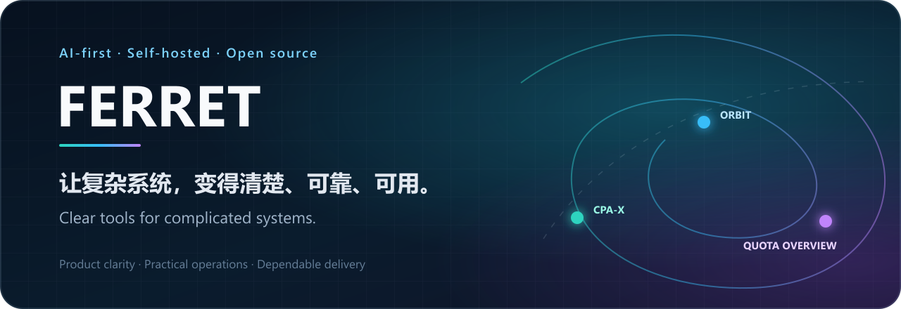
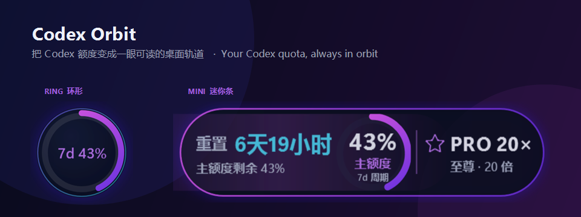
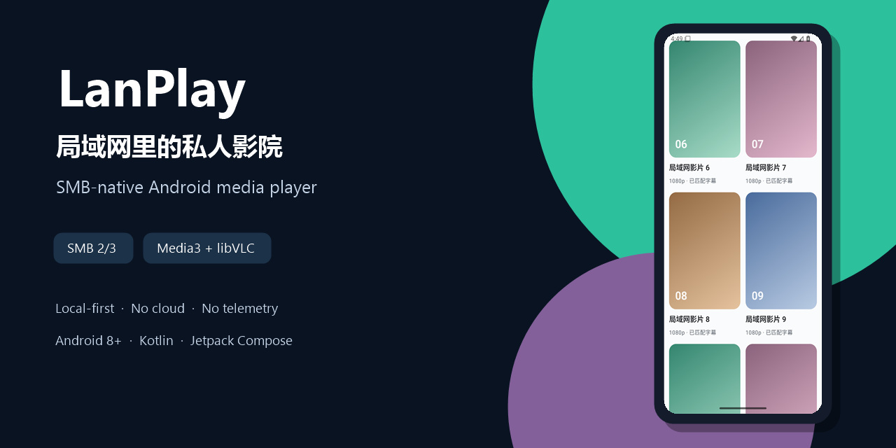
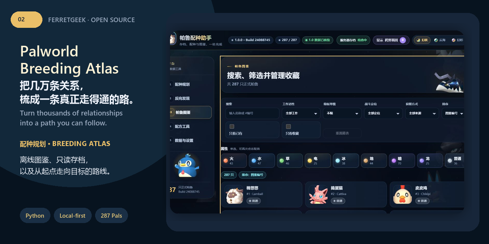
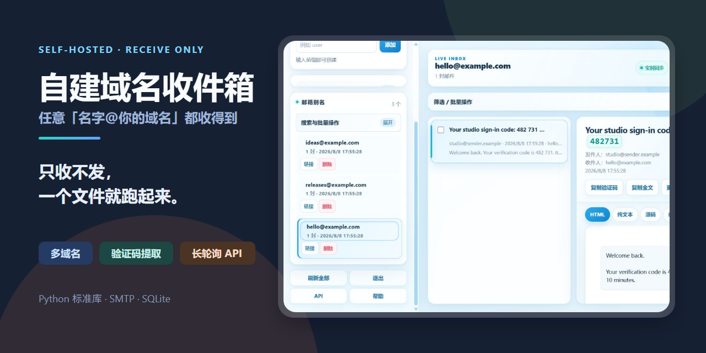
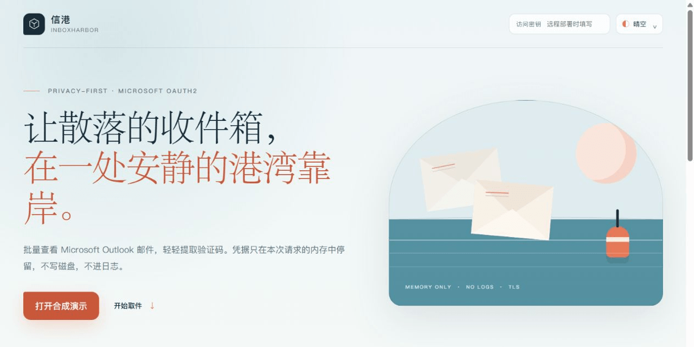
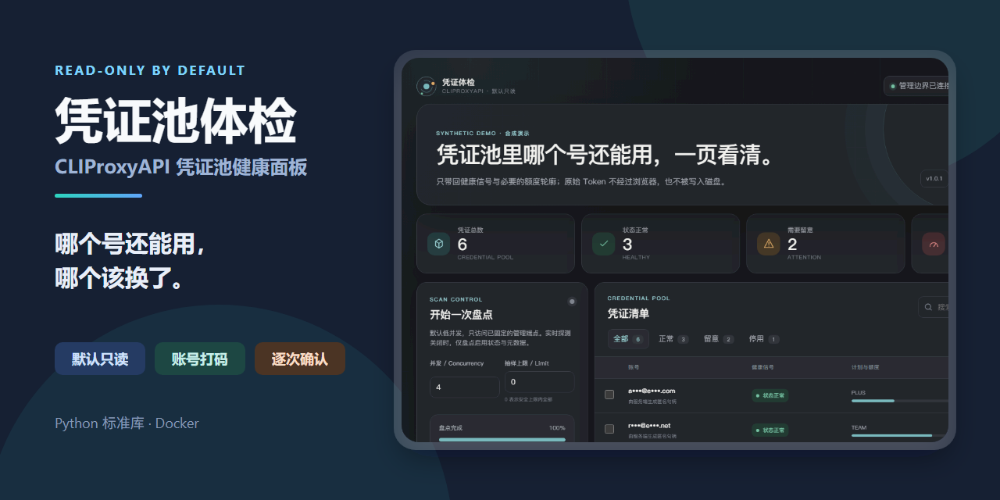
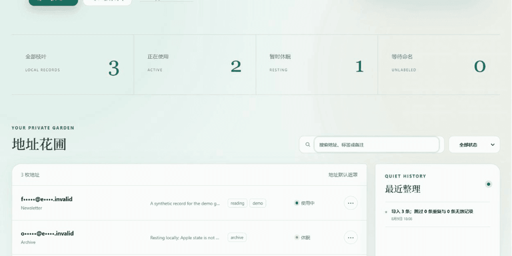
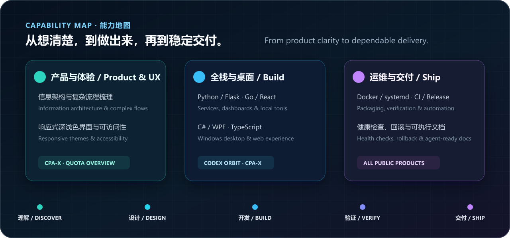

  

  
  
  
  

  <strong>我喜欢把复杂的东西慢慢理清，再做成安静、可靠、有人情味的工具。</strong> 
  <em>I like untangling complicated things and turning them into calm, dependable tools with a human touch.</em>

---

## 作品 / Work

### 01 · [CPA-X](https://github.com/ferretgeek/CPA-X)

**给自托管服务一扇清楚的窗。** 状态、用量、日志与更新都在眼前，让维护少一点紧张，多一点确定。

*A clear window into a self-hosted service—health, usage, logs, and updates in one calm place.*

**看点 / Focus** — 运行全景 / overview · 安全更新与回滚 / safe updates and rollback · Windows / Linux / Docker · **技术 / Stack** — `Python` · `Flask` · `Waitress`

[项目 / Repository](https://github.com/ferretgeek/CPA-X) · [下载 / Releases](https://github.com/ferretgeek/CPA-X/releases/latest) · [中文文档 / Docs](https://github.com/ferretgeek/CPA-X/blob/main/README_CN.md)

---

### 02 · [Codex Orbit](https://github.com/ferretgeek/CodexOrbit)

**让额度安静地待在桌面边缘。** 它不打扰，只在需要时告诉你还剩多少时间与空间。

*Let quota rest quietly at the edge of the desktop, appearing only when you need a sense of time and room.*

**看点 / Focus** — 一眼可读 / glanceable · 多主题与迷你视图 / themes and compact views · 本地、无遥测 / local, no telemetry · **技术 / Stack** — `C#` · `WPF` · `.NET Framework 4.8`

[项目 / Repository](https://github.com/ferretgeek/CodexOrbit) · [下载 / Releases](https://github.com/ferretgeek/CodexOrbit/releases/latest) · [架构 / Architecture](https://github.com/ferretgeek/CodexOrbit/blob/main/docs/ARCHITECTURE.md)

---

### 03 · [Codex Quota Overview](https://github.com/ferretgeek/codex-quota-overview)

**把散落的账户状态，收进一张可以看懂的全景图。** 扫描、查询和导出都留在本地，照看许多账户也不再手忙脚乱。

*Gather scattered account states into one readable, local panorama for calmer work at scale.*

**看点 / Focus** — 批量导入 / bulk import · 大规模分页 / large result sets · 汇总与 CSV / summaries and CSV · **技术 / Stack** — `Go` · `React` · `TypeScript` · `Vite`

[项目 / Repository](https://github.com/ferretgeek/codex-quota-overview) · [下载 / Releases](https://github.com/ferretgeek/codex-quota-overview/releases/latest) · [使用说明 / Guide](https://github.com/ferretgeek/codex-quota-overview/blob/main/README.md)

---

### 04 · [LanPlay](https://github.com/ferretgeek/LanPlay)

**让局域网里沉睡的影片，重新回到手边。** 不需要账号，也不必把私人片库交给云端。

*Bring the films sleeping on your local network back within reach—without an account or the cloud.*

**看点 / Focus** — SMB 浏览 / SMB browsing · 双播放内核 / dual playback engines · 字幕、续播与本地历史 / subtitles, resume, local history · **技术 / Stack** — `Kotlin` · `Compose` · `Media3` · `libVLC`

[项目 / Repository](https://github.com/ferretgeek/LanPlay) · [使用说明 / Guide](https://github.com/ferretgeek/LanPlay/blob/main/README.md) · [讨论 / Discussions](https://github.com/ferretgeek/LanPlay/discussions)

---

### 05 · [Vibe Prompt Recorder](https://github.com/ferretgeek/VibePromptRecorder)

**每一轮提示词，都是思路走过的路。** 把项目、草稿与迭代留在本地时间线里，让灵感不再散落。

*Every prompt iteration is a path the idea once took—kept together in a private, local timeline.*

**看点 / Focus** — 轮次时间线 / iteration timeline · Markdown 双模式 / two editing modes · 搜索、备份与恢复 / search, backup, recovery · **技术 / Stack** — `Tauri 2` · `Rust` · `React` · `SQLite`

[项目 / Repository](https://github.com/ferretgeek/VibePromptRecorder) · [使用说明 / Guide](https://github.com/ferretgeek/VibePromptRecorder/blob/main/README.md) · [讨论 / Discussions](https://github.com/ferretgeek/VibePromptRecorder/discussions)

---

### 06 · [Palworld Ops](https://github.com/ferretgeek/PalworldOps)

**让一台小小的服务器，也有被认真照看的日常。** 状态、性能、备份与世界设置，都收进一张清楚的管理页。

*Give a small server the calm, careful routine it deserves—health, performance, backups, and world settings in one view.*

**看点 / Focus** — 安全运维 / guarded operations · 可验证备份 / verified backups · systemd 自动化 / automation · **技术 / Stack** — `Python` · `JavaScript` · `SQLite` · `systemd`

[项目 / Repository](https://github.com/ferretgeek/PalworldOps) · [使用说明 / Guide](https://github.com/ferretgeek/PalworldOps/blob/main/README.md) · [讨论 / Discussions](https://github.com/ferretgeek/PalworldOps/discussions)

---

### 07 · [帕鲁配种图鉴 / Palworld Breeding Atlas](https://github.com/ferretgeek/PalworldBreedingAtlas)

**把几万条关系，梳成一条真正走得通的路。** 287 条图鉴、配种规划与只读存档，都留在本地。

*Turn thousands of relationships into a path you can actually follow—with a 287-entry atlas, planning, and read-only saves.*

**看点 / Focus** — 路线规划 / route planning · 反向发现 / reverse discovery · 本地、无遥测 / local, no telemetry · **技术 / Stack** — `Python` · `Tkinter` · `HTML` · `JavaScript`

[项目 / Repository](https://github.com/ferretgeek/PalworldBreedingAtlas) · [使用说明 / Guide](https://github.com/ferretgeek/PalworldBreedingAtlas/blob/main/README.md) · [数据说明 / Data](https://github.com/ferretgeek/PalworldBreedingAtlas/blob/main/docs/%E6%95%B0%E6%8D%AE%E6%9D%A5%E6%BA%90%E4%B8%8E%E6%9B%B4%E6%96%B0.md)

---

### 08 · [Ferret Mail](https://github.com/ferretgeek/FerretMail)

**给自己的域名，留一间接住消息的房间。** SMTP、网页后台与 API，轻巧地住在一份 Python 文件里。

*Give your domain a quiet room built simply to receive—SMTP, a web dashboard, and an API in one Python file.*

**看点 / Focus** — 多域名收件 / multi-domain inbox · 验证码与附件 / codes and attachments · 备份与限流 / backup and rate limits · **技术 / Stack** — `Python stdlib` · `SMTP` · `SQLite`

[项目 / Repository](https://github.com/ferretgeek/FerretMail) · [部署 / Deploy](https://github.com/ferretgeek/FerretMail/blob/main/%E9%83%A8%E7%BD%B2%E6%95%99%E7%A8%8B.md) · [API / Docs](https://github.com/ferretgeek/FerretMail/blob/main/%E6%8A%80%E6%9C%AF%E6%96%87%E6%A1%A3.md)

---

### 09 · [航迹 / Trailmark](https://github.com/ferretgeek/Trailmark)

**每一次连通，都该有一段能够解释的旅程。** 航迹让节点穿过真实代理通道，告诉你哪里慢、哪里断，什么依然可用。

*Every connection deserves an explainable journey—through a real proxy path, from DNS to the page that finally answers.*

**看点 / Focus** — 真实链路检测 / real-path probes · DNS、TCP、TLS 与页面特征 / layered diagnostics · 本地与服务器 / local and server · **技术 / Stack** — `Python` · `FastAPI` · `SQLite` · `sing-box`

[项目 / Repository](https://github.com/ferretgeek/Trailmark) · [English](https://github.com/ferretgeek/Trailmark/blob/main/README_EN.md) · [部署 / Deploy](https://github.com/ferretgeek/Trailmark/blob/main/docs/%E9%83%A8%E7%BD%B2%E4%B8%8E%E8%BF%90%E7%BB%B4.md)

---

### 10 · [信渡 / Mail Ferry](https://github.com/ferretgeek/MailFerry)

**让每一封来信，都抵达它该去的地方。** 把 IMAP 邮箱化成独立、可撤销的取件链接，在自己的设备上安静流转。

*Let every message arrive where it belongs—through private, revocable pickup links hosted on your own machine.*

**看点 / Focus** — 独立取件链接 / revocable pickup links · 缓存与降级读取 / resilient cache · 本地与服务器 / local and server · **技术 / Stack** — `Python stdlib` · `IMAP` · `SQLite` · `systemd`

[项目 / Repository](https://github.com/ferretgeek/MailFerry) · [English](https://github.com/ferretgeek/MailFerry/blob/main/README_EN.md) · [部署 / Deploy](https://github.com/ferretgeek/MailFerry/blob/main/docs/%E9%83%A8%E7%BD%B2%E8%AF%B4%E6%98%8E.md)

---

### 11 · [别名工坊 / Alias Atelier](https://github.com/ferretgeek/AliasAtelier)

**让一枚邮箱地址长出不同的名字，却仍回到同一个安静的收件箱。** 粘贴、预览、带走，秘密始终留在浏览器里。

*Let one mailbox grow many names while every message returns to the same quiet inbox—without sending your data away.*

**看点 / Focus** — 纯本地处理 / local-only · 敏感字段安全遮挡 / masked metadata · 四套全局主题 / four global themes · **技术 / Stack** — `JavaScript` · `Python stdlib` · `Docker` · `Nginx`

[项目 / Repository](https://github.com/ferretgeek/AliasAtelier) · [English](https://github.com/ferretgeek/AliasAtelier/blob/main/README_EN.md) · [部署 / Deploy](https://github.com/ferretgeek/AliasAtelier/blob/main/docs/%E9%83%A8%E7%BD%B2%E8%AF%B4%E6%98%8E.md)

---

### 12 · [信港 / InboxHarbor](https://github.com/ferretgeek/InboxHarbor)

**把散落的收件箱安静地带回一处。** 批量取件、轻拾验证码，凭据不在磁盘留下脚印。

*Bring scattered inboxes quietly home—batch reading and code extraction without leaving credentials on disk.*

**看点 / Focus** — OAuth2 现代认证 / modern auth · 内存凭据 / memory-only credentials · 隐私遮罩 / privacy veil · 四套全局主题 / four themes · **技术 / Stack** — `Python stdlib` · `JavaScript` · `Docker`

[项目 / Repository](https://github.com/ferretgeek/InboxHarbor) · [English](https://github.com/ferretgeek/InboxHarbor/blob/main/README_EN.md) · [部署 / Deploy](https://github.com/ferretgeek/InboxHarbor/blob/main/docs/DEPLOYMENT.md)

---

### 13 · [凭证罗盘 / Credential Compass](https://github.com/ferretgeek/CredentialCompass)

**让散落的凭证，回到一张清楚的航图。** 只看健康信号与额度轮廓，秘密始终停在边界之内。

*Bring scattered credentials back onto one clear chart—health signals in view, secrets kept behind the boundary.*

**看点 / Focus** — 默认只读 / read-only by default · 账号遮罩 / masked identities · 可逆状态控制 / reversible controls · 四套全局主题 / four themes · **技术 / Stack** — `Python stdlib` · `JavaScript` · `Docker`

[项目 / Repository](https://github.com/ferretgeek/CredentialCompass) · [English](https://github.com/ferretgeek/CredentialCompass/blob/main/README_EN.md) · [部署 / Deploy](https://github.com/ferretgeek/CredentialCompass/blob/main/docs/DEPLOYMENT.md)

---

### 14 · [隐邮花园 / Veil Garden](https://github.com/ferretgeek/VeilGarden)

**把替你挡住身份的地址，种进自己的花园。** 不接管 Apple 账户，只在自己的设备上整理、遮罩与带走地址。

*Tend every address that stands between your identity and the world—in a garden that stays yours.*

**看点 / Focus** — 默认遮罩 / masked by default · 本地导入与备份 / local import and backup · 四套全局主题 / four themes · **技术 / Stack** — `Python stdlib` · `JavaScript` · `SQLite` · `Docker`

[项目 / Repository](https://github.com/ferretgeek/VeilGarden) · [English](https://github.com/ferretgeek/VeilGarden/blob/main/README_EN.md) · [部署 / Deploy](https://github.com/ferretgeek/VeilGarden/blob/main/docs/DEPLOYMENT.md)

---

## 能力地图 / Capability map

  

这些作品跨过后台、网页、Windows 与 Android，却做着同一件事：让复杂退后，让人更安心地使用技术。 
*Across backend, web, Windows, and Android, they share one purpose: let complexity step back.*

## 做东西的方式 / A way of making

先理解人真正会在哪里停下来，再设计界面与流程；把复杂藏进系统，把清楚与从容留给使用者。 
*Understand where people pause; keep complexity inside the system and leave clarity at the surface.*

  
  
  
  
  
  
  
  
  
  

---

问题、想法与合作，欢迎来到对应项目的 Issues 或 Discussions。 / *Ideas and collaboration are welcome in each project's Issues or Discussions.*

Codex Orbit、Codex Quota Overview 与 Credential Compass 是非官方社区项目，与 OpenAI 没有隶属、授权或背书关系，也不会绕过任何额度限制。Palworld Ops 与 Palworld Breeding Atlas 同样是非官方社区项目，与 Pocketpair 没有隶属、授权或背书关系。InboxHarbor 与 Veil Garden 分别是独立项目，与 Microsoft 或 Apple 没有隶属或背书关系。 / The Codex projects are unofficial and do not bypass usage limits. The Palworld projects are not affiliated with or endorsed by Pocketpair. InboxHarbor and Veil Garden are independent projects, not affiliated with or endorsed by Microsoft or Apple.

  <strong>Open source should make difficult work feel possible.</strong> 
  开源不只是公开代码，也应该让困难的事情真正变得可完成。

