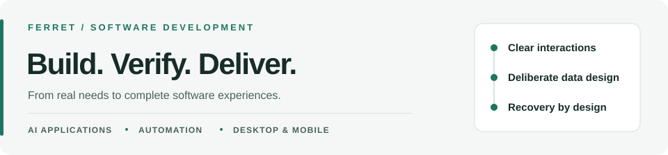

<picture>
  <source media="(prefers-color-scheme: dark)" srcset="./assets/profile-dark.svg">
  
</picture>

中文 · [English](./README_EN.md)

# 你好，我是 ferret

**专注 AI 应用、自动化服务与桌面 / 移动端开发。**

我喜欢把真实使用场景中的需求，转化为交互清晰、数据可控、便于维护的软件。我的开源实践覆盖从需求拆解、界面设计、接口与数据存储，到测试验证、打包发布和部署维护的完整过程。

比起单纯增加功能，我更关注功能背后的工程问题：**AI 的表现如何客观衡量？后台任务中断后怎样继续？应用升级失败后如何恢复？敏感数据应该在哪里保存？** 下面的项目，是我对这些问题的具体实践。

[代表项目](#user-content-代表项目) · [工程实践](#user-content-工程实践) · [更多项目](#user-content-更多项目)

## 代表项目

### [CPA-X · AI 接口服务管理](https://github.com/ferretgeek/cliproxyapi-dashboard)

为已部署的 CLIProxyAPI 提供可视化管理：查看运行状态、请求日志，并在 Linux 下管理服务升级。

- **实现重点：** 增量解析日志；升级经过 SHA-256 校验、原子替换和真实接口健康检查，失败时触发回滚，并对失败版本退避重试。
- **设计考虑：** 进程启动不等于服务可用。把“更新成功”建立在接口验证上，并为失败准备恢复路径。

`Python` · `Flask` · `Linux / systemd`

### [大模型 API 性能评测](https://github.com/ferretgeek/llm-api-benchmark)

在固定测试场景下，比较模型接口多久开始响应、输出有多快，以及估算的 API 成本。

- **实现重点：** 解析流式响应，分别记录首字延迟、输出速度和 Token 用量；预热与正式样本分离，完整用量与中断估算分开统计。
- **设计考虑：** 不把并发吞吐当成单请求速度，也不把估算当成账单，让结果有明确口径、便于复测。

`Python` · `流式 API` · `性能测量`

### [Outlook 授权维护服务](https://github.com/ferretgeek/outlook-token-keeper)

集中维护已获授权的邮箱账号，定时刷新授权、检查连接状态，并记录需要人工处理的异常。

- **实现重点：** Web 与后台 Worker 分离；任务和进度持久化到 PostgreSQL，支持单 Worker 重启后续跑；凭据采用绑定账号与字段的 AES-256-GCM 加密。
- **设计考虑：** 批量操作不依赖网页一直开着；敏感字段不仅要加密，还要校验它属于哪个账号，防止密文被错位替换。

`Python / FastAPI` · `PostgreSQL` · `OAuth 2.0` · `Docker`

### [提示词手账 · 本地优先桌面应用](https://github.com/ferretgeek/prompt-journal)

按项目和轮次管理与 AI 协作时的提示词，支持编辑、检索、导出与备份，数据保存在自己的电脑上。

- **实现重点：** React 交互层与 Rust 本地逻辑配合；SQLite WAL 与事务管理数据，版本检查识别编辑冲突，结合原子文件写入、关闭保护和恢复流程。
- **设计考虑：** 自动保存之外，还要处理同时修改、意外退出和数据迁移，减少静默覆盖与数据丢失的风险。

`TypeScript / React` · `Rust / Tauri 2` · `SQLite`

### [Android 局域网视频播放器](https://github.com/ferretgeek/android-smb-player)

在手机上直接播放电脑或 NAS 共享目录中的视频，无需先复制影片，也无需额外部署转码服务。

- **实现重点：** 接入 SMB 2/3 共享，整合 Media3 与 libVLC 双播放内核，处理字幕、续播、观看记录和设备端凭据加密。
- **设计考虑：** 将网络读取、播放控制和本地数据管理拆开，应对不同媒体格式与使用环境，而不只是播放一个示例视频。

`Kotlin` · `Jetpack Compose` · `Media3 / libVLC` · `SMB`

### [帕鲁配种路线规划](https://github.com/ferretgeek/palworld-breeding-atlas)

从玩家实际拥有的帕鲁出发，规划目标配种路线，比较不同方案需要的步骤和额外资源。

- **实现重点：** 对配种关系进行多策略路线求解，结合库存与亲本性别约束；存档只读解析，限制输入与解压体积；求解器可独立运行回归测试。
- **设计考虑：** 把静态配方查询推进为带约束的路线规划，同时处理数据来源、异常输入和算法验证。

`Python` · `JavaScript` · `路线求解` · `数据解析`

## 工程实践

我在项目中持续落实的，不只是功能清单：

- **为失败设计：** 用健康检查、事务、任务进度与备份恢复处理异常，而不是只验证正常流程。
- **明确数据与权限边界：** 按场景使用凭据加密、日志脱敏、只读访问和写入确认，让数据流向与操作权限可解释。
- **让交付可以验证：** 在不同项目中配置类型检查、单元 / 回归测试和 CI，并补齐环境要求、部署步骤及恢复说明。

主要技术实践围绕 **Python 服务端、TypeScript / React 界面、Rust / Tauri 桌面应用与 Kotlin Android 开发** 展开；根据数据与部署需求选用 SQLite、PostgreSQL、Docker 和 systemd。

## 更多项目

<b>展开其余 12 个项目 · AI 工作流 / 邮件服务 / 网络与运维</b>

### AI 工作流与应用集成

| 项目 | 方向与实现 |
| :--- | :--- |
| [Obsidian AI 写作助手](https://github.com/ferretgeek/obsidian-ai-writer) | 用户选择笔记上下文，多协议模型接入，文件修改先预览差异、确认后写回。基于 `grok-obsidian` 的独立衍生开发，来源见仓库 NOTICE。 |
| [Codex 桌面额度监控](https://github.com/ferretgeek/codex-quota-widget) | Windows 悬浮窗展示剩余额度与重置时间，并提供低额度提醒。 |
| [Codex 多账号额度总览](https://github.com/ferretgeek/codex-quota-overview) | 导入已有登录文件，集中查询多账号额度并导出结果。 |
| [CLIProxyAPI 凭据状态检查](https://github.com/ferretgeek/cliproxyapi-credential-check) | 汇总账号启用状态，可选探测可用性与额度；区分静态清单和在线检查。 |

### 邮件服务与授权访问

| 项目 | 方向与实现 |
| :--- | :--- |
| [自建域名收件服务](https://github.com/ferretgeek/domain-mail-inbox) | Python 标准库实现 SMTP 收件、HTTP API 与 SQLite 存储，支持域名级权限与健康检查；只收信、不发信。 |
| [Outlook 批量收件台](https://github.com/ferretgeek/outlook-batch-inbox) | 集中查询多个已授权邮箱的新邮件与验证码。 |
| [IMAP 网页取件服务](https://github.com/ferretgeek/imap-pickup-links) | 为已有邮箱生成可撤销的网页访问链接，控制收件内容的访问入口。 |
| [iCloud 验证码检索](https://github.com/ferretgeek/icloud-code-finder) | 从近期邮件中提取验证码，简化授权邮箱的收件查询。 |
| [Apple 隐藏邮件地址管理](https://github.com/ferretgeek/hide-my-email-manager) | 管理已导入地址的标签、备注、搜索与备份；不修改 Apple 端状态。 |
| [邮箱别名生成](https://github.com/ferretgeek/email-alias-generator) | 在浏览器本地生成带标签的收件地址；是否支持收信取决于邮箱服务商。 |

### 网络监测与服务运维

| 项目 | 方向与实现 |
| :--- | :--- |
| [代理节点可用性监测](https://github.com/ferretgeek/proxy-uptime-monitor) | 通过节点实际访问目标网页，持续记录连通性与故障情况。 |
| [帕鲁服务器管理面板](https://github.com/ferretgeek/palworld-server-panel) | 管理已搭建的 Linux 专用服务器，覆盖运行状态、配置、备份与更新。 |

---

**想体验项目？** 点击项目名查看说明与界面，发布版本见各仓库的 **Releases**；部分项目需要源码构建或自行部署。

**想交流实现或反馈问题？** 欢迎在对应仓库的 **Issues** 留言。源码、架构说明与测试，是了解这些项目的进一步入口。
