<!-- 图片由本地设计脚本生成；assets/stats 由 .github/workflows/stats.yml 每日自动更新。 -->

  <a href="https://github.com/ferretgeek"><picture><source media="(prefers-color-scheme: dark)" srcset="./assets/en/switch-dark.svg"></picture></a>
  <a href="https://ferretgeek.github.io/?lang=en"><picture><source media="(prefers-color-scheme: dark)" srcset="./assets/en/site-dark.svg"></picture></a>

<a href="https://ferretgeek.github.io/?lang=en"><picture><source media="(prefers-color-scheme: dark)" srcset="./assets/en/hero-dark.svg"></picture></a>

<a href="#user-content-works">Selected Works</a> · <a href="#user-content-index">More Works</a> · <a href="#user-content-principles">Principles</a> · <a href="#user-content-activity">Activity</a> · <a href="#user-content-contact">Contact</a> · <a href="https://ferretgeek.github.io/?lang=en">Website</a> · <a href="https://github.com/ferretgeek">中文</a>

<picture><source media="(prefers-color-scheme: dark)" srcset="./assets/en/section-works-dark.svg"></picture>

<a href="https://github.com/ferretgeek/cliproxyapi-dashboard"><picture><source media="(prefers-color-scheme: dark)" srcset="./assets/en/work-cliproxyapi-dashboard-dark.svg">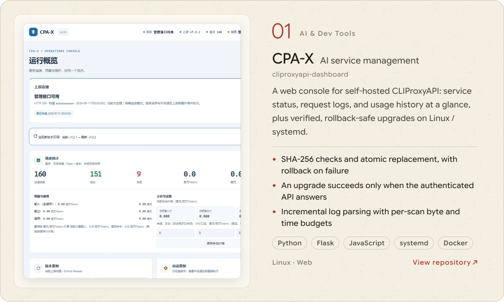</picture></a>

<a href="https://github.com/ferretgeek/llm-api-benchmark"><picture><source media="(prefers-color-scheme: dark)" srcset="./assets/en/work-llm-api-benchmark-dark.svg">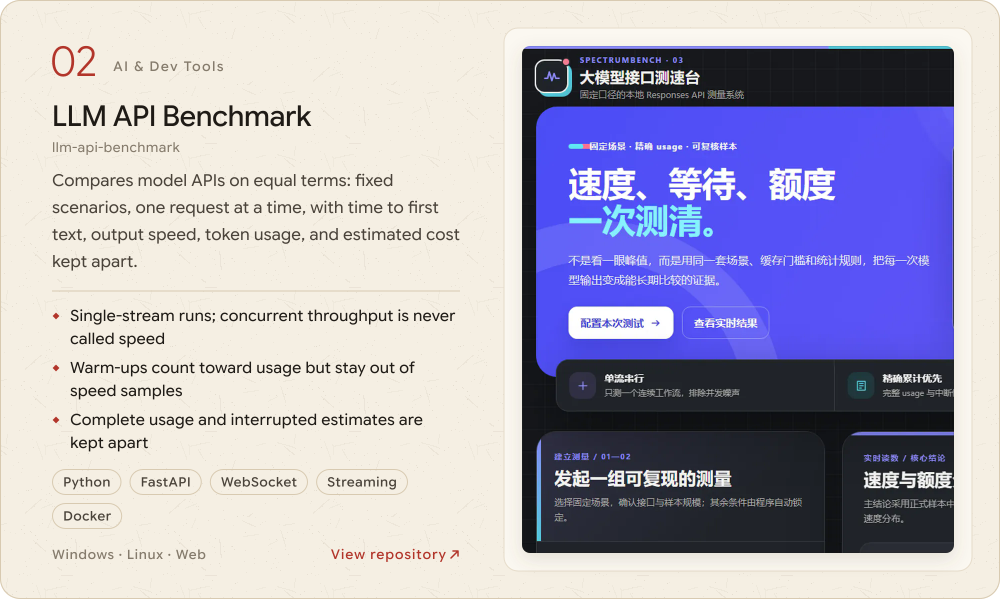</picture></a>

<a href="https://github.com/ferretgeek/outlook-token-keeper"><picture><source media="(prefers-color-scheme: dark)" srcset="./assets/en/work-outlook-token-keeper-dark.svg">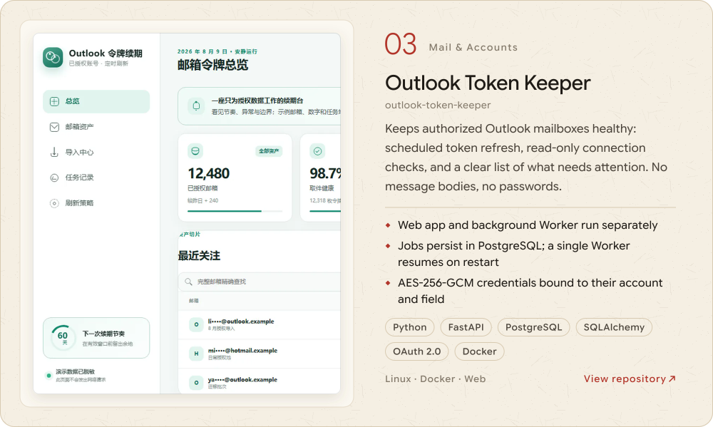</picture></a>

<a href="https://github.com/ferretgeek/prompt-journal"><picture><source media="(prefers-color-scheme: dark)" srcset="./assets/en/work-prompt-journal-dark.svg">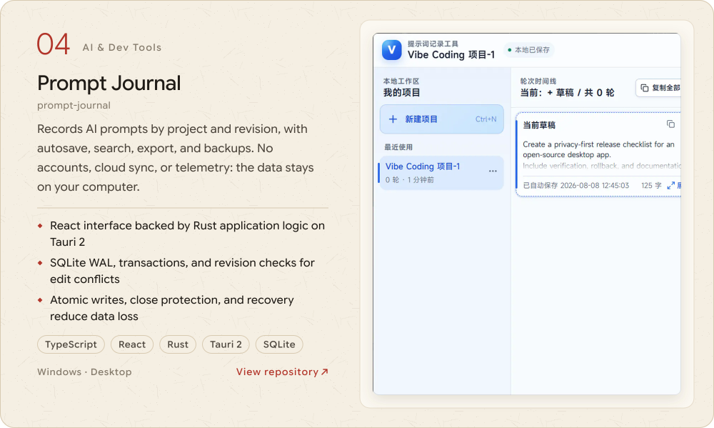</picture></a>

<a href="https://github.com/ferretgeek/android-smb-player"><picture><source media="(prefers-color-scheme: dark)" srcset="./assets/en/work-android-smb-player-dark.svg"></picture></a>

<a href="https://github.com/ferretgeek/palworld-breeding-atlas"><picture><source media="(prefers-color-scheme: dark)" srcset="./assets/en/work-palworld-breeding-atlas-dark.svg">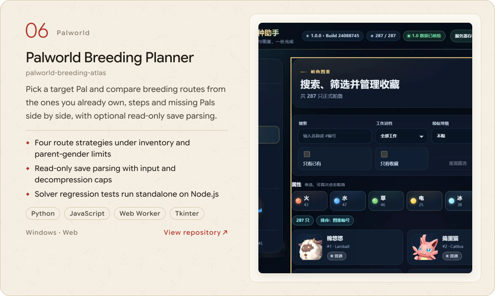</picture></a>

<picture><source media="(prefers-color-scheme: dark)" srcset="./assets/en/section-index-dark.svg"></picture>

<picture><source media="(prefers-color-scheme: dark)" srcset="./assets/en/group-ai-dark.svg"></picture>

  <a href="https://github.com/ferretgeek/obsidian-ai-writer"><picture><source media="(prefers-color-scheme: dark)" srcset="./assets/en/tile-obsidian-ai-writer-dark.svg">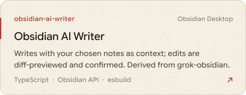</picture></a>
  <a href="https://github.com/ferretgeek/codex-quota-widget"><picture><source media="(prefers-color-scheme: dark)" srcset="./assets/en/tile-codex-quota-widget-dark.svg">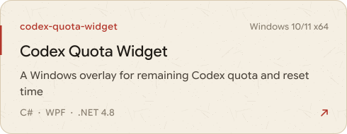</picture></a>

  <a href="https://github.com/ferretgeek/codex-quota-overview"><picture><source media="(prefers-color-scheme: dark)" srcset="./assets/en/tile-codex-quota-overview-dark.svg">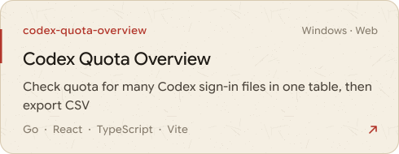</picture></a>
  <a href="https://github.com/ferretgeek/cliproxyapi-credential-check"><picture><source media="(prefers-color-scheme: dark)" srcset="./assets/en/tile-cliproxyapi-credential-check-dark.svg">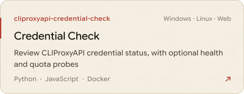</picture></a>

<picture><source media="(prefers-color-scheme: dark)" srcset="./assets/en/group-mail-dark.svg"></picture>

  <a href="https://github.com/ferretgeek/domain-mail-inbox"><picture><source media="(prefers-color-scheme: dark)" srcset="./assets/en/tile-domain-mail-inbox-dark.svg">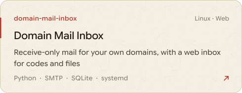</picture></a>
  <a href="https://github.com/ferretgeek/outlook-batch-inbox"><picture><source media="(prefers-color-scheme: dark)" srcset="./assets/en/tile-outlook-batch-inbox-dark.svg">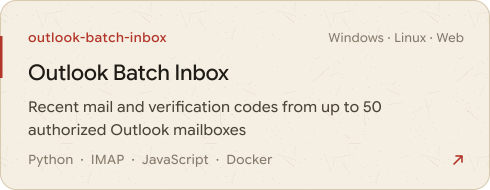</picture></a>

  <a href="https://github.com/ferretgeek/imap-pickup-links"><picture><source media="(prefers-color-scheme: dark)" srcset="./assets/en/tile-imap-pickup-links-dark.svg">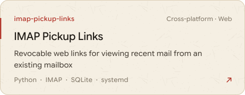</picture></a>
  <a href="https://github.com/ferretgeek/icloud-code-finder"><picture><source media="(prefers-color-scheme: dark)" srcset="./assets/en/tile-icloud-code-finder-dark.svg"></picture></a>

  <a href="https://github.com/ferretgeek/hide-my-email-manager"><picture><source media="(prefers-color-scheme: dark)" srcset="./assets/en/tile-hide-my-email-manager-dark.svg">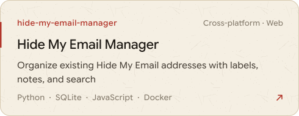</picture></a>
  <a href="https://github.com/ferretgeek/email-alias-generator"><picture><source media="(prefers-color-scheme: dark)" srcset="./assets/en/tile-email-alias-generator-dark.svg">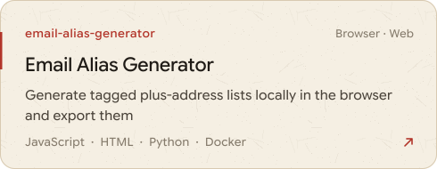</picture></a>

<picture><source media="(prefers-color-scheme: dark)" srcset="./assets/en/group-more-dark.svg"></picture>

  <a href="https://github.com/ferretgeek/proxy-uptime-monitor"><picture><source media="(prefers-color-scheme: dark)" srcset="./assets/en/tile-proxy-uptime-monitor-dark.svg">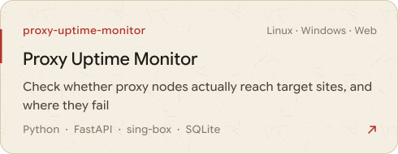</picture></a>
  <a href="https://github.com/ferretgeek/palworld-server-panel"><picture><source media="(prefers-color-scheme: dark)" srcset="./assets/en/tile-palworld-server-panel-dark.svg">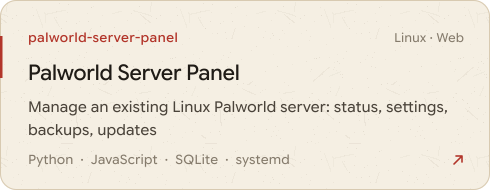</picture></a>

<picture><source media="(prefers-color-scheme: dark)" srcset="./assets/en/section-principles-dark.svg"></picture>

<picture><source media="(prefers-color-scheme: dark)" srcset="./assets/en/principles-dark.svg">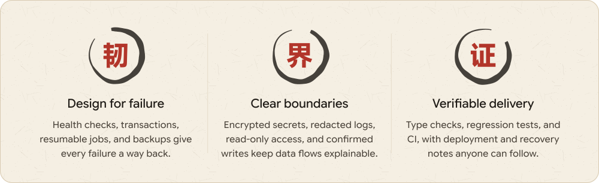</picture>

<picture><source media="(prefers-color-scheme: dark)" srcset="./assets/en/toolbox-dark.svg">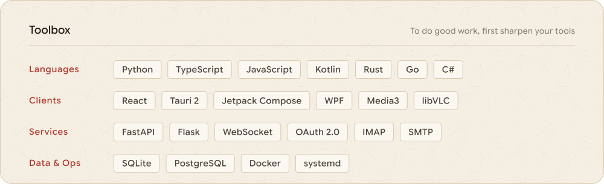</picture>

<picture><source media="(prefers-color-scheme: dark)" srcset="./assets/en/section-activity-dark.svg"></picture>

<a href="https://github.com/ferretgeek?tab=repositories"><picture><source media="(prefers-color-scheme: dark)" srcset="./assets/stats/en-dark.svg">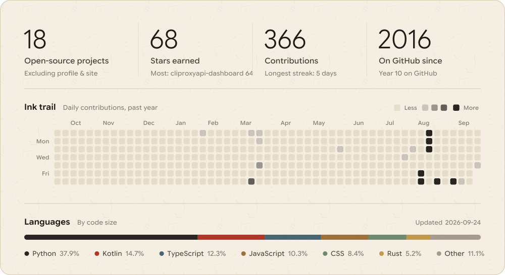</picture></a>

<picture><source media="(prefers-color-scheme: dark)" srcset="./assets/en/section-contact-dark.svg"></picture>

<a href="mailto:ferretgeek@vip.qq.com"><picture><source media="(prefers-color-scheme: dark)" srcset="./assets/en/contact-dark.svg"></picture></a>

<a href="mailto:ferretgeek@vip.qq.com">ferretgeek@vip.qq.com</a> · <a href="https://ferretgeek.github.io/?lang=en">ferretgeek.github.io</a> Chinese type: MiSans · Latin type: Google Sans Flex · Images generated by script, stats refreshed daily

